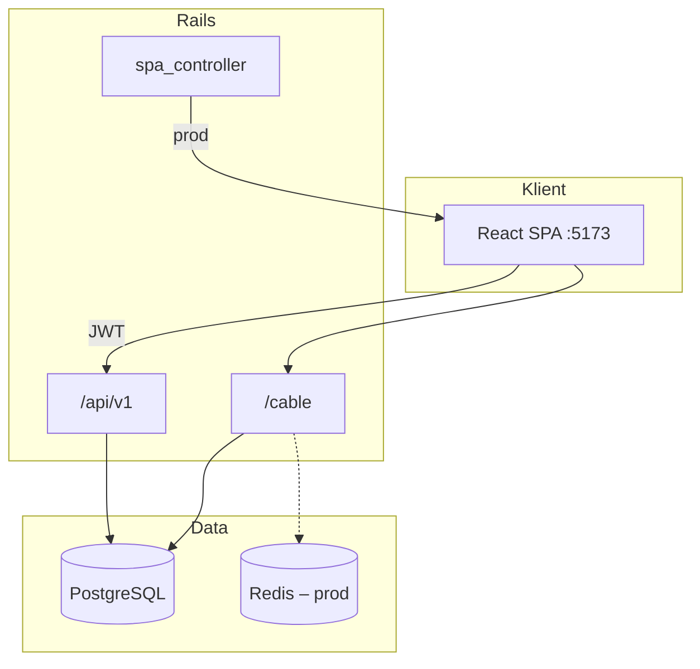
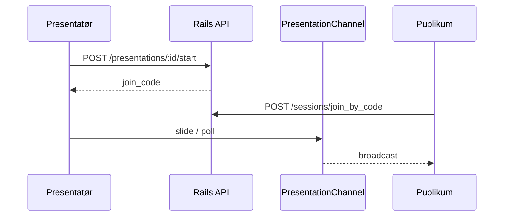

# ProSlides


Webapp for å lage, redigere og holde presentasjoner. Slides bygges i nettleseren (Fabric.js), live-økter kjøres med join-kode, og publikum følger presentasjonen via **Action Cable**.

**Produksjon:** [slides.rubynor.com](https://slides.rubynor.com) · **Monorepo:** `backend/` (Rails API) + `frontend/` (Vite/React SPA)

---

<details>
<summary><strong>Innholdsfortegnelse</strong></summary>

- [Stack](#stack)
- [Utvikling](#utvikling)
- [Arkitektur](#arkitektur)
- [Prosjektstruktur](#prosjektstruktur)
- [Kodekoblinger](#kodekoblinger)
- [API](#api)
- [Miljøvariabler](#miljøvariabler)
- [Deploy](#deploy)
- [Tester](#tester)
- [Feilsøking](#feilsøking)

</details>

---

## Stack

| Del | Teknologi |
|-----|-----------|
| Backend | Rails 8.1 API, Puma, PostgreSQL, JWT, OmniAuth, Action Cable |
| Frontend | Vite, React 18, TypeScript, Tailwind, Fabric.js, shadcn/ui |
| Deploy | Kamal 2, Docker, Redis (prod), Traefik-proxy |
| CI | Playwright (`frontend/.github/workflows/playwright.yml`) |

| Mappe | Rolle |
|-------|--------|
| [`backend/`](backend/) | REST `/api/v1`, WebSocket `/cable`, DB, serverer `frontend/dist` i prod |
| [`frontend/`](frontend/) | SPA: auth, editor, live, polls |
| [`scripts/kamal.ps1`](scripts/kamal.ps1) | Kjører Kamal med `backend/` som arbeidsmappe |

---

## Utvikling

### Krav

Ruby `~> 3.4.8`, Bundler, Node.js LTS, PostgreSQL (`DATABASE_URL` i `backend/.env`).

Lokalt bruker Action Cable `async`-adapter (`config/cable.yml`) — Redis er ikke påkrevd i development.

### Oppstart

```bash
# Terminal 1
cd backend && cp .env.example .env
# DATABASE_URL og SECRET_KEY_BASE i .env
bundle install && bin/setup && bin/rails server

# Terminal 2
cd frontend && npm install && npm run dev
```

| Tjeneste | URL (dev) |
|----------|-----------|
| SPA | http://localhost:5173 |
| API | http://localhost:3000/api/v1 |
| Health | `GET /api/v1/health` |

`bin/setup` kjører `db:prepare`.

### Vite-proxy

| Sti | Mål |
|-----|-----|
| `/api` | `VITE_DEV_BACKEND_ORIGIN` eller `http://localhost:3000` |
| `/cable` | Samme origin (WebSocket) |

Annen backend-port: `frontend/.env` → `VITE_DEV_BACKEND_ORIGIN=http://localhost:3002`.

### Kommandoer

| Mappe | Kommando |
|-------|----------|
| `backend/` | `bin/rails db:migrate` · `bin/rails console` |
| `frontend/` | `npm run build` · `npm run lint` · `npm run test:e2e` |

---

## Arkitektur



| Miljø | Frontend | Backend | Cable |
|-------|----------|---------|--------|
| Development | Vite `:5173` → proxy | `:3000` | `async` |
| Production | `public/` (Docker-build) | Kamal | `redis` |

**Slides:** ingen `slides_controller`. `PUT /api/v1/presentations/:id` erstatter alle slides via `Presentations::ReplaceSlidesService`.



| Flyt | Frontend | Backend |
|------|----------|---------|
| Auth | `features/auth/Login.tsx`, `services/api.ts` | `auth_controller`, `json_web_token.rb` |
| Slides | `features/editor/PresentationEditor.tsx` | `presentations#update`, `ReplaceSlidesService` |
| Live start | `SessionLobby`, `app/App.tsx` | `presentations#start` → `PresentationSession` |
| Live synk | `features/live/*` | `presentation_channel.rb` |
| Join | `features/live/JoinPage.tsx` | `sessions#guest_join`, `#join_by_code` |

---

## Prosjektstruktur

```
Bachelor_Gruppe1/
├── backend/          # Rails, deploy.yml, Dockerfile
├── frontend/         # Vite/React
└── scripts/kamal.ps1
```

<details>
<summary><strong>Backend – filstruktur</strong></summary>

```
backend/
├─ app/
│  ├─ channels/presentation_channel.rb
│  ├─ controllers/
│  │  ├─ spa_controller.rb
│  │  ├─ concerns/authenticatable.rb
│  │  └─ api/v1/ (auth, health, polls, presentations, sessions)
│  ├─ models/ (+ concerns/slide_payload_normalizer.rb)
│  ├─ serializers/presentation_serializer.rb
│  └─ services/
│     ├─ json_web_token.rb
│     └─ presentations/replace_slides_service.rb
├─ config/ (routes, deploy.yml, cable.yml, omniauth.rb, …)
└─ db/ (schema.rb, migrate/)
```

| Sti | Funksjon |
|-----|----------|
| `presentation_channel.rb` | WebSocket: slides, polls, deltakere |
| `authenticatable.rb` | JWT → `current_user` |
| `spa_controller.rb` | Serverer `public/` i prod |
| `replace_slides_service.rb` | Atomisk erstatning av slide-liste |
| `presentation_serializer.rb` | JSON `summary` / `one` |

**Modeller:** `User` → `Presentation` → `Slide` · `PresentationSession` · `SessionParticipant` · `Poll` / `PollOption` / `PollResponse`

</details>

<details>
<summary><strong>Frontend – filstruktur</strong></summary>

```
frontend/src/
├─ main.tsx
├─ app/App.tsx
├─ features/
│  ├─ auth/Login.tsx
│  ├─ editor/ (PresentationEditor, SlideThumbnails, SyncedHostedEmbed, …)
│  ├─ live/ (JoinPage, LivePresentation*, SessionLobby, ui/, …)
│  └─ polls/ (PollsPage, components/)
├─ components/ui/   # shadcn
├─ hooks/           # usePresentation, useIsMobileDevice
├─ lib/             # fabric*, embed*, fullscreen
└─ services/api.ts
```

| Sti | Funksjon |
|-----|----------|
| `app/App.tsx` | Sidenavigasjon: login, home, editor, polls, lobby, live, join |
| `services/api.ts` | Axios, JWT i `localStorage` (`auth_token`) |
| `lib/fabric*.ts` | Fabric.js canvas og slide-objekter |

Import-alias: `@/` → `src/`.

**Legacy (uimportert):** `src/components/livesession/`, `src/components/polls/` — aktiv kode ligger i `features/`.

</details>

---

## Kodekoblinger

| Område | Filer |
|--------|--------|
| App-navigasjon | `frontend/src/app/App.tsx` |
| REST-klient | `frontend/src/services/api.ts` |
| Ruter | `backend/config/routes.rb` |
| Slide-lagring | `replace_slides_service.rb`, `slide_payload_normalizer.rb`, `PresentationEditor.tsx` |
| Live WebSocket | `presentation_channel.rb`, `features/live/` |
| Join / gjest | `sessions_controller.rb`, `JoinPage.tsx` |
| Auth | `auth_controller.rb`, `authenticatable.rb`, `json_web_token.rb` |
| CORS / OAuth | `config/initializers/omniauth.rb`, `.env` |
| Deploy | `config/deploy.yml`, `backend/Dockerfile`, `scripts/kamal.ps1` |

API-kontrakt: `routes.rb` (server) · `api.ts` (klient).

---

## API

| | Development | Production |
|---|-------------|------------|
| REST | `/api/v1` (Vite-proxy) | `https://<host>/api/v1` |
| WebSocket | `/cable` | `wss://<host>/cable` |

| Metode | Sti | Beskrivelse |
|--------|-----|-------------|
| POST | `/auth/register`, `/auth/login` | JWT |
| GET | `/auth/me` | Innlogget bruker |
| GET/POST | `/auth/:provider/callback` | OAuth |
| CRUD | `/presentations` | Presentasjoner; slides i body ved `update` |
| POST | `/presentations/:id/start` | Live-økt + `join_code` |
| POST | `/presentations/:id/end_session` | Avslutt økt |
| POST | `/sessions/guest_join`, `/join_by_code` | Publikum |
| | `/polls` | CRUD, `vote`, `results` |

Full rute-liste: [`backend/config/routes.rb`](backend/config/routes.rb).

**Action Cable:** `PresentationChannel` · param `presentation_id` · klient `@rails/actioncable` · auth via JWT i `application_cable/connection.rb`.

---

## Miljøvariabler

### Backend (`backend/.env` ← `.env.example`)

| Variabel | Development | Production (Kamal) |
|----------|-------------|---------------------|
| `DATABASE_URL` | Påkrevd | Secret |
| `SECRET_KEY_BASE` | Påkrevd | Secret |
| `ALLOWED_ORIGINS` | — | `deploy.yml` |
| `FRONTEND_URL` | — | OAuth redirect |
| `OMNIAUTH_FULL_HOST` | — | Offentlig https-host |
| `GOOGLE_*` / `GITHUB_*` | Valgfritt | Secret; tom = provider slått av i `omniauth.rb` |
| `REDIS_URL` | — | `deploy.yml` + Redis accessory |
| `KAMAL_REGISTRY_PASSWORD` | — | Docker registry |

`.env` er gitignored (`secrets_path` i Kamal).

### Frontend (`frontend/.env`, valgfritt)

| Variabel | Beskrivelse |
|----------|-------------|
| `VITE_DEV_BACKEND_ORIGIN` | Proxy-mål (default `http://localhost:3000`) |
| `VITE_API_BASE_URL` | Direkte API-base uten proxy |
| `VITE_WS_URL` | WebSocket-origin |

---

## Deploy

Konfigurasjon: [`backend/config/deploy.yml`](backend/config/deploy.yml).

| | |
|---|---|
| Host | `slides.rubynor.com` |
| Image | `backend/Dockerfile` (frontend-build → `public/`) |
| Redis | Kamal accessory `slides-redis` |
| Cable (prod) | `redis` adapter |

```bash
cd frontend && npm run build          # valgfritt; skjer i Docker
cd backend && bundle exec kamal deploy
# Windows: ./scripts/kamal.ps1 deploy
```

Kamal-aliases: `console` → Rails console · `shell` → container bash.

`spa_controller` + catch-all i `routes.rb` serverer SPA unntatt `/api`, `/cable`, `/up`, `/rails`.

---

## Tester

| Type | Sti | Kommando |
|------|-----|----------|
| E2E | `frontend/tests/` | `cd frontend && npm run test:e2e` |
| E2E UI | Playwright | `npm run test:e2e:ui` |
| CI | `frontend/.github/workflows/playwright.yml` | push/PR |

`rspec-rails` finnes i `Gemfile`; specs under `backend/spec/`.

---

## Feilsøking

| Symptom | Konfigurasjon |
|---------|----------------|
| CORS i dev | Klient mot `localhost:5173` (Vite), ikke kun `:3000` |
| CORS i prod | `ALLOWED_ORIGINS` = SPA-origin |
| Cable | Dev: proxy `/cable` · Prod: `REDIS_URL`, Redis accessory |
| OAuth redirect | Callback-URL i provider + `OMNIAUTH_FULL_HOST` |
| `db:prepare` | `DATABASE_URL`, PostgreSQL tilgjengelig |
| Tom SPA i prod | `public/index.html` fra frontend Docker-stage |

---

*Sist oppdatert: mai 2026.*

*README strukturert med Cursor AI.*
